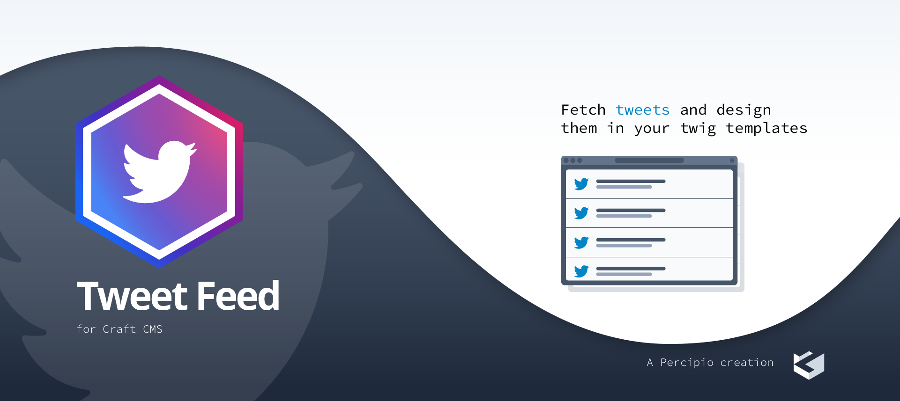
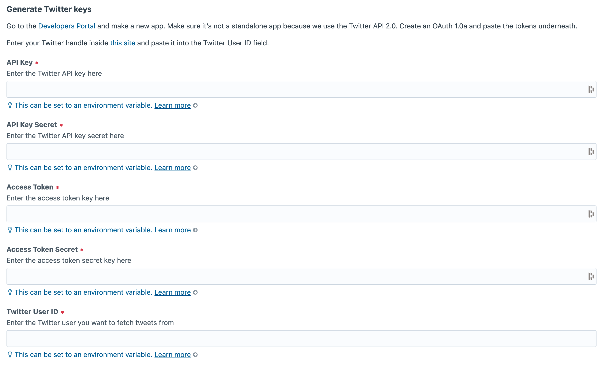

# Tweet Feed plugin for Craft CMS 3.x

Get the latest tweets from a Twitter handle with your own design



## Requirements

This plugin requires Craft CMS 3.5.0 or later. We utilise Guzzle 6 and up (7 included) and Twitter v2.0.

## Installation

To install the plugin, follow these instructions.

1. Open your terminal and go to your Craft project:

        cd /path/to/project

2. Tell Composer to load the plugin:

        composer require percipiolondon/craft-tweet-feed

3. In the Control Panel, go to Settings → Plugins and click the “Install” button for Tweet.

## Tweet Feed Overview

This plugin provides a Twitter feed from a specific Twitter handle. 

## Configuring Tweet Feed

To make this happen, you need to make an app in the <a href="https://developer.twitter.com/en/portal/dashboard" target="_blank">Developers Portal</a>. Make sure it's <u>not</u> a standalone app because we use the Twitter API 2.0.

Create your keys and tokens and paste them into the plugin settings page. Make sure you create an OAuth 1.0a and generate the access tokens.

Besides the keys and tokens, we also require the Twitter user id to provide the tweets from a specific handle. If you don't know the id, you can look it op on <a href="https://codeofaninja.com/tools/find-twitter-id/" target="_blank">this site</a>.

You can provide all of this inside of your environment file.



## Using Tweet Feed

To make use of  Tweet Feed, we created a Craft variable to fetch.

The `craft.tweetfeed.tweets()` function can have 3 parameters. 

#### First param: amount of results (default: 100)
The first one will ask for the number of results you want to receive. There's a maximum of 100 results that can be fetched. Here's a list of all the <a href="https://developer.twitter.com/en/docs/twitter-api/rate-limits" target="_blank">Twitter API v2 rate limits</a>.

<i>example: 3</i>

#### Second param: types of fields (default: null)
The types of fields are the data you want to receive from Twitter. By default, the id and text are provided. We also add the `entities` so you can already use the tweet url. To know all the options, you can visit the <a href="https://developer.twitter.com/en/docs/twitter-api/data-dictionary/object-model/tweet" target="_blank">Tweet object</a> page.

Always provide the list with a comma as separation.

<i>example: author_id,context_annotations</i>

#### Third param: extra parameters (default: '')
If you want to extend the query, you can add extra parameters to the url. The `max_results` and `tweet.fields` are already used in the previously shown parameters. To know which kind of parameters excists, you can visit the <a href="https://developer.twitter.com/en/docs/twitter-api/tweets/timelines/api-reference/get-users-id-tweets" target="_blank">GET /2/users/:id/tweets</a> page and scroll to 'Query parameters'.

To provide these parameters for our plugin, use the following example. You can tie parameters to each other by using `&`.

<i>example: &exclude=retweets,replies&user.fields=id</i>

### Twig example
```



   <div>
       <h3>{{ tweet.text }}</h3>
   </div>

```

#### Use cache tag to reduce calls
There is a limit on API calls per day. If you have a high traffic site, we recommend using the `cache` tag from CraftCMS to reduce calls.

For example:
```

   
   
   
      <div>
          <h3>{{ tweet.text }}</h3>
      </div>
   

```

## Tweet Feed Roadmap

Some updates to do and ideas for potential features:

* GQL support

Brought to you by [percipiolondon](https://percipio.london)
